# gcplogger
Simple logger with corresponding GCloud logging configuration steps

## 1 Repo set-up

### 1.1 Create an empty Repo (in GitHub)

This can be Private or Public:

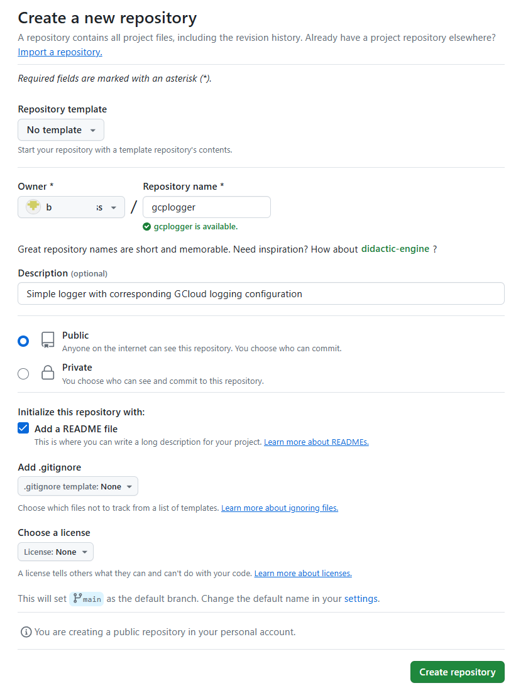

### 1.2 Copy Repo location to clipboard

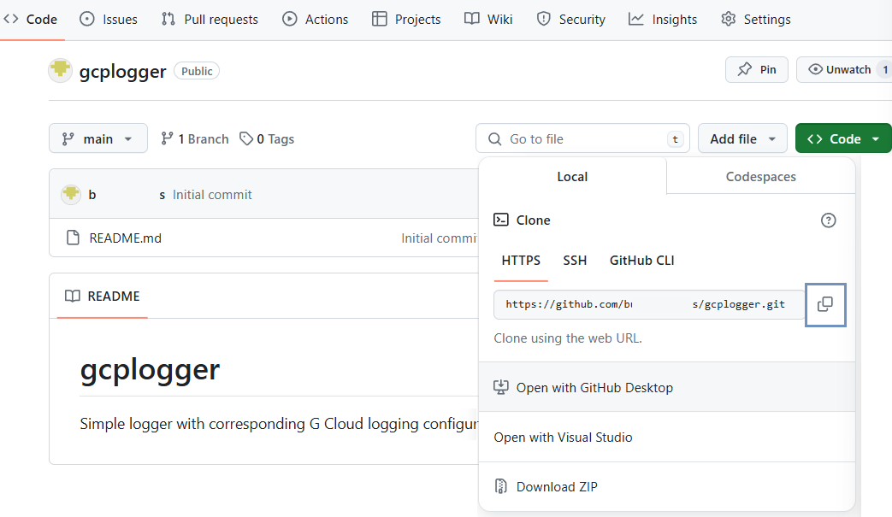

### 1.3 Create the parent working folder

On the local Desktop (using the Command Prompt):

`cd %HOMEPATH%` 
`mkdir projects` 
`cd projects`

### 1.4 Clone the repo

`git clone <paste>` (paste in the URL copied into Clipboard from GitHub above)

## 2 Configure GCloud Logging Service Account

This technical account is needed to secure the transport channel from applications to the Cloud log(s)

### 2.1 Create the script

Switch to the same subfolder (see above):

`cd %HOMEPATH%\projects\gcplogger\logsetup`

Create the script file, a complete script is available here:

[createServiceAccount script](https://github.com/burningglass/gcplogger/blob/main/logsetup/createServiceAccount.sh)

Be sure to replace the [PROJECT_ID] placeholder in this script

### 2.2 Execute the script to create the Service Account

Execute the script, carefully monitoring its output to ensure no errors with service account set-up

If the script executed successfully, the new service account should be visible from the GCloud dashboard Service Accounts page - see below:

**Important:** The output is a file called sa-pk.json, ensure that you rename this with a '.' prefix (to .sa-pk.json) so filesystems will hide it

Save this file under a top-level `/var/.tokens` folder, i.e. from the root of the local drive

Note. This output file (`/var/.tokens/.sa-pk.json`) is referenced by the application's .env file (defining all environment variables)

**Important:** The .sa-pk.json (a secret token) should remain **outside** version control and **never copied** into application artifacts

## 3 Develop a test application

### 3.1 Create the Python virtual environment

Use VS Code Terminal to create the application's Python virtual environment

Each project should have its own discrete set of package references

`cd %HOMEPATH%\projects` 
`pip list` reveals all Python system-wide packages 

Create the virtual environment:

`python -m venv .venv`

### 3.2 Activate the virtual environment

Activate the virtual environment (the .venv folder should appear in the project folder):

`cd .venv\Scripts` 
`.\activate.bat` 
`pip list --local`

The final command should now reveal only those Python packages installed for this project:

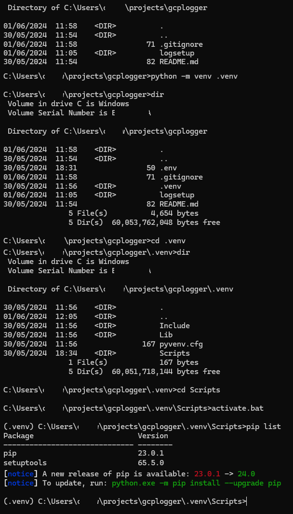

**Important:** Before opening Visual Studio Code (next step), open a Powershell Command Prompt and ensure Powershell has rights to run the virtual environment activation script:

`Set-ExecutionPolicy -Scope CurrentUser -ExecutionPolicy Unrestricted`

### 3.3 Open VS Code within the project folder

`cd %HOMEPATH%\projects\gcplogger` 
`code .`

### 3.4 Install python-dotenv to enable Env support

This will allow the Python application to read key-value pairs from an .env file in the root project folder

Issue this command (e.g. from VS Code's Terminal):

`pip install python-dotenv` (which installs this in the project's virtual env)

Now create and populate the .env file as follows (replacing PROJECT_ID with the actual GCloud Project ID and DB_AUP with the strong password - see section 2.2):

`\# Consider the following as 'secrets' (e.g. deploy in a mem-mounted cfg file (not env vars) when running in K8s)` 
`GOOGLE_APPLICATION_CREDENTIALS=/var/.tokens/.sa-pk.json` 

### 3.5 Install/enable GCloud Logger library

This  establishes Python application connections to Google Cloud Logging using:
- IAM Authorization based on a GCloud Service Account (ensuring a genuine connection to the target Cloud log)
- a TLS 1.3 encrypted channel (it transparently creates this channel and manages all requisite cert (re)generation/exchange with GCloud)

Issue this command (e.g. from VS Code's Terminal):

`cd %HOMEPATH%\projects\gcplogger` 
`pip install --upgrade google-cloud-logging` 

The above will install this into the project's virtual env

### 3.6 Freeze the application's package version dependency requirements

Issue the following command (**Important:** issue this from VS Code's Terminal where the Terminal prompt shows the prefix '(.venv)' since the Python virtual environment must be showing active, reflecting all packages installed by the steps above):

`cd %HOMEPATH%\projects\gcplogger` 
`pip freeze > requirements.txt`

The resulting file (requirements.txt) now lists all packages(with versions) the application requires to run

[Fixed dependencies for Python application](https://github.com/burningglass/gcplogger/blob/main/requirements.txt)

### 3.7 Develop the application's main logic class (with entry-point)

Create a new file called logger.py, the complete example is available in Github:

[registrationstore](https://github.com/burningglass/gcplogger/blob/main/logger.py)

With this file open, hit F5 to run/debug the application (it should write the test log entry to the log in GCloud)

## 4 Update the repo

### 4.1 Set contributing-user properties (if necessary)

Under `%HOMEPATH%\projects\gcplogger`:

`git config --global user.name "<ContributorName>"` 
`git config --global user.email "<ContributorEmailAddress>"`

### 4.2 Push code and config back to GitHub

Under `%HOMEPATH%\projects\gcplogger`:

`git add .env` 
`git add .gitignore` 
`git add logger.py` 
`git add requirements.txt` 
`git commit -m "Initial bulk (GCloud logger) code upload"` 
`git push` 

## 5 Check GCLoud Logs for written entries

In GCloud Console, in the menu 'View All Products' and then choose 'Observability' and 'Logging'

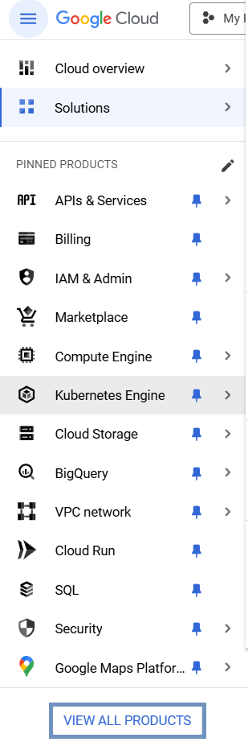

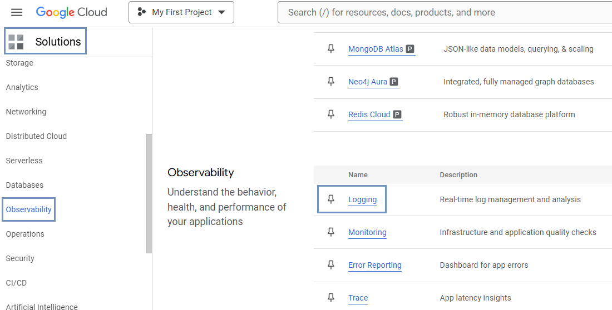

In the Logging Dashboard, select the name of the log (created and written to by the above Python script) and 'Jump to Now' to see the written log entries

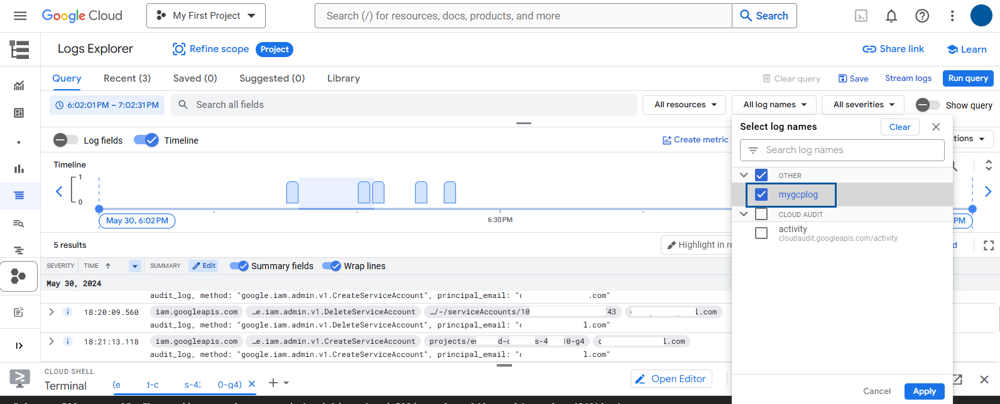

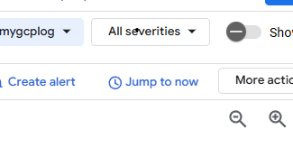

## 6 Capturing/Aggregating Logs from Individual Hosts

GCLoud Logging can serve as an aggregator for logs accumulating on hosts across an organization

Simple shipping of logs from hosts to GCloud is achievable via https://www.fluentbit.io/

To test this, switch to "Compute Engine" in the menu and "VM Instances" and create a very cheap Compute Engine VM on GCloud (e.g. a low-spec. E2 SPOT machine with a CentOS 9 Boot Disk)

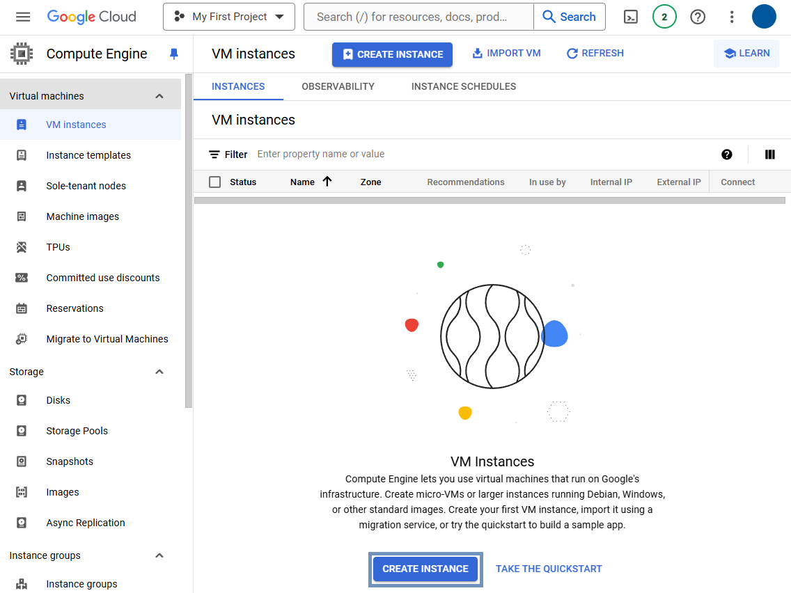

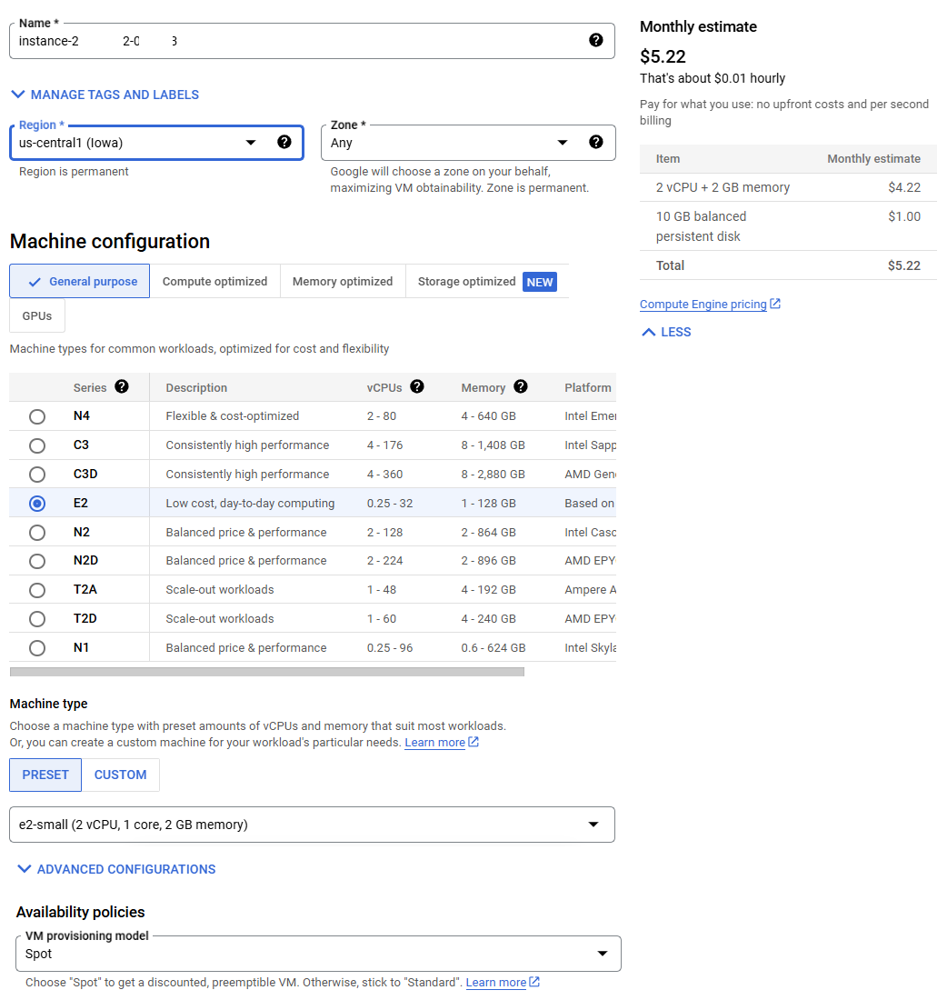

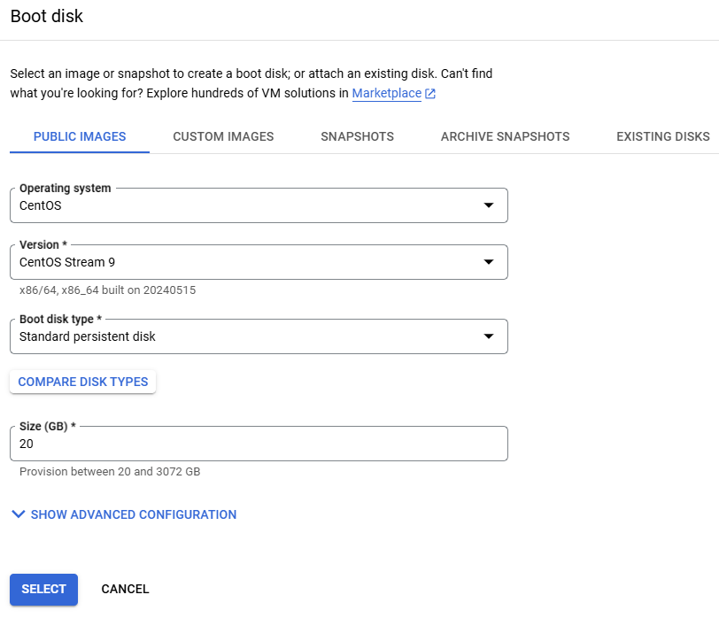

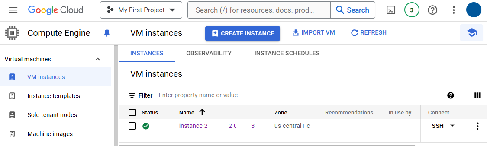

